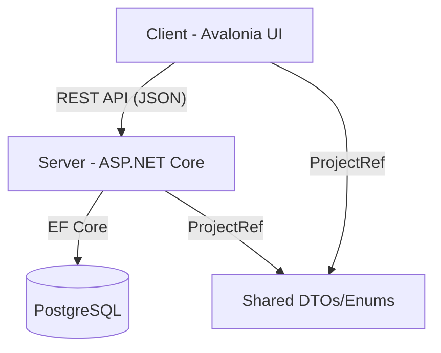

# 📄 Контекст Проекта: Finance Tracker (Diplom)

Этот файл предназначен для быстрого погружения в проект при открытии новой сессии с ИИ. Он содержит описание архитектуры, технологий и текущего состояния разработки.

---

## 🎯 Общее описание
**Finance Tracker** — это кросс-платформенное приложение для учёта личных финансов, построенное на принципах **двойной бухгалтерии**. Система поддерживает мультивалютные счета, аналитику по категориям и контроль обязательств (долгов).

---

## 🏗 Архитектура Системы

Проект разделен на три части:
1.  **Client (Avalonia UI)**: Десктопное приложение (MVVM).
2.  **Server (ASP.NET Core)**: REST API сервис.
3.  **Shared**: Общая библиотека DTO и перечислений.

---

## 🛠 Технологический Стек

### Общее
- **Платформа**: .NET 8 (C# 12)
- **База данных**: PostgreSQL 16 (в Docker-контейнере)

### Client
- **UI Framework**: Avalonia UI 11.3
- **Архитектура**: MVVM (CommunityToolkit.Mvvm)
- **Графики**: LiveCharts2
- **Локальное хранилище**: SQLite (для offline-режима и синхронизации)

### Server
- **Web**: ASP.NET Core 8
- **ORM**: Entity Framework Core 8
- **Auth**: JWT (JSON Web Token)
- **API Doc**: Swagger/OpenAPI

---

## 📁 Структура Проекта

### [📂 Client](file:///c:/Users/viner/OneDrive/Рабочий стол/Diplom/Client)
- **Models/**: Классы данных клиента.
- **ViewModels/**: Бизнес-логика UI.
- **Views/**: AXAML разметка окон и диалогов.
- **Services/**:
    - `ApiDataService.cs`: Обмен данными с сервером.
    - `LocalDbService.cs`: Работа с SQLite.
    - `SyncService.cs`: Логика синхронизации.
    - `MockDS.cs`: Демо-данные для разработки.

### [📂 Server](file:///c:/Users/viner/OneDrive/Рабочий стол/Diplom/Server)
- **Controllers/**: Обработчики HTTP-запросов (`Accounts`, `Transactions`, `Auth`, `Reports`).
- **Entities/**: Сущности БД (User, Account, Transaction, Entry, Obligation).
- **Data/AppDbContext.cs**: Конфигурация EF Core и связей.
- **Services/**: `CbrExchangeRateService.cs` (курсы ЦБ РФ + криптовалюты).

### [📂 Shared](file:///c:/Users/viner/OneDrive/Рабочий стол/Diplom/Shared)
- **DTOs**: `AccountDto`, `TransactionDto`, `AuthResponse` и др.
- **Enums**: `AccountKind` (Assets, Income, Expenses), `EntryDirection` (Debit, Credit).

---

## 📑 Основные Сущности (Domain Model)
- **Account (Счёт)**: Может быть обычным или многовалютным. Имеет тип (Актив, Доход, Расход).
- **Transaction (Транзакция)**: Группирует 2 и более проводок.
- **Entry (Проводка)**: Базовая единица двойной записи (Debit/Credit, Сумма, Валюта, Счёт, Категория).
- **Category (Категория)**: Группировка расходов или доходов.
- **Obligation (Обязательство)**: Долг (нам должны / мы должны) с датой погашения.

---

## 🚀 Текущий Статус и Планы

### Текущее состояние
- ✅ Базовая бухгалтерия (счета, операции, категории).
- ✅ Многовалютность и автоматическая конвертация.
- ✅ Графики и отчеты (CSV экспорт).
- ✅ Авторизация и многопользовательский режим.
- ✅ Базовая синхронизация Client <-> Server.

### В приоритете (см. [ПЛАН_КЛИЕНТ.md](file:///c:/Users/viner/OneDrive/Рабочий стол/Diplom/Client/ПЛАН_КЛИЕНТ.md))
1.  **Синхронизация**: Улучшение алгоритмов слияния и очереди оффлайн-изменений.
2.  **Обязательства**: Уведомления и индикация просрочки.
3.  **Семейный учет**: Разделение прав доступа и общие счета.
4.  **UX/UI**: Тонкая настройка графиков и анимаций.

---

## 💡 Подсказки для ИИ
- При работе со счетами всегда учитывай `AccountKind`.
- Транзакции **всегда** должны быть сбалансированы (сумма Дебетов = сумма Кредитов в рамках одной валюты).
- Большинство операций на сервере требуют `UserId` (извлекается из JWT в `UserContext.cs`).
- В клиенте для навигации используется смена свойства `CurrentViewModel` в `MainWindowViewModel`.
